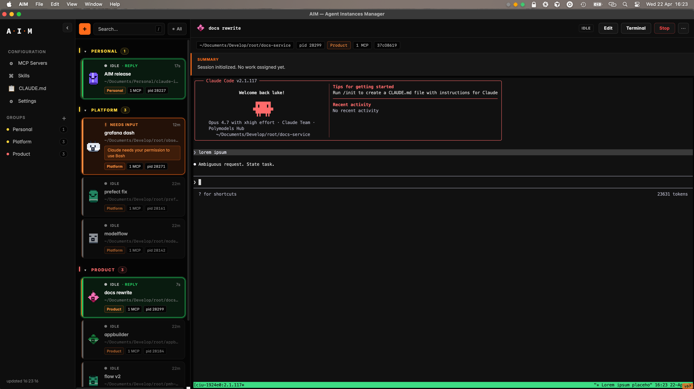

# AIM — Agent Instances Manager

Native macOS app for managing multiple concurrent [Claude Code](https://claude.com/claude-code) sessions. Create sessions, drive them interactively in a built-in terminal, and monitor their state from the system tray.

Every session runs inside tmux. Hooks write per-session state files that the app reads to render status, summaries, and transcripts.



---

## Install

Apple Silicon (M1/M2/M3/M4) required. macOS 13 Ventura or newer.

```bash
brew install lmarini556/tap/aim
```

That's it. Launch from Spotlight or:

```bash
open /Applications/AIM.app
```

On first launch AIM installs its hooks into `~/.claude/settings.json` so Claude Code sessions are tracked automatically.

---

## Features

- **Create** sessions with `+ New instance` — name, cwd, MCP config
- **Drive** them in-app — full terminal via PTY proxy, mouse scroll, copy-mode, resize
- **Resume** across restarts
- **Status at a glance**: running / needs input / idle / ended, colour-coded
- **Rolling LLM summaries** of what each session is doing
- **Groups**, rename, restart with new config
- **System tray** — dynamic icon reflects aggregate status
- **Native notifications + sound** on state transitions
- **Global shortcut** `⌘⇧C` toggles window

---

## Architecture

```
  AIM.app (Tauri v2, Rust)
     │
     ├── axum HTTP/WS server on 127.0.0.1:7878
     │    ├── REST API (instances, groups, config, settings)
     │    └── WebSocket terminal (xterm.js ↔ pty ↔ tmux attach)
     │
     ├── WebView → http://127.0.0.1:7878/
     │    └── Vanilla JS + xterm.js (static/)
     │
     ├── System tray (5 state icons)
     ├── 2s poller (state transitions → notifications + sound)
     └── Global shortcut (Cmd+Shift+C)

  Bundled resources:
     ├── tmux (static binary, arm64)
     └── hook_writer.py (copied to ~/.claude-instances-ui/bin/ on first launch)
```

---

## Uninstall

```bash
brew uninstall --zap aim
```

`--zap` also removes state from `~/.claude-instances-ui/` and Tauri-managed cache directories. Hook entries in `~/.claude/settings.json` are left in place — remove them manually if desired.

---

## Build from Source

Requirements: Rust toolchain, Xcode command-line tools.

```bash
git clone https://github.com/lmarini556/aim.git
cd aim/src
cargo tauri build
```

Outputs:
- `target/release/bundle/macos/AIM.app`
- `target/release/bundle/dmg/AIM_<version>_aarch64.dmg`

For development: `cargo tauri dev` hot-reloads the webview against a running debug binary.

---

## License

See `LICENSE`.
